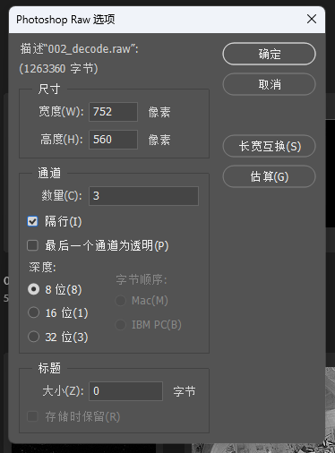
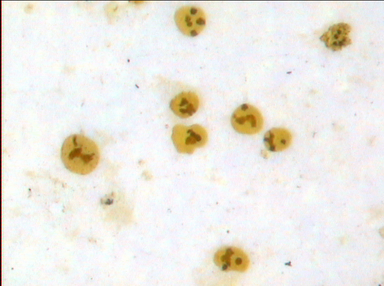
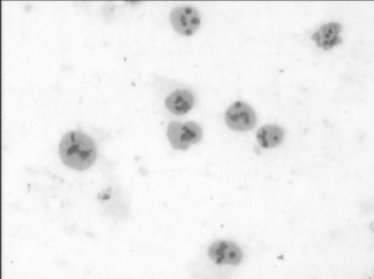
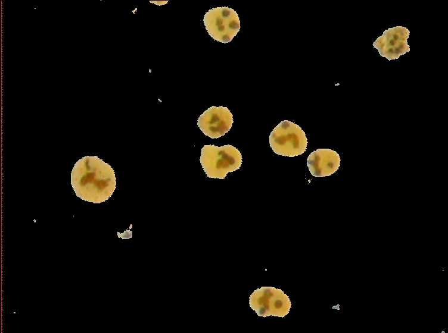

# segmentation_and_encode
北航宇航学院大二数据结构大作业

## 使用方法

直接编译执行即可

:warning:注意：如果你不是使用这里的CMakeLists.txt进行编译，请设置你的IDE，使其将编译生成的可执行文件放在本项目的根目录下。

使用Photoshop打开彩色的raw图像时，配置如下

    

## 文件结构

* `main.c` 主程序
* `include ` 放置头文件
* `src` 放置源文件，包括用于数字图像处理的`dip.c`和用于Huffman编码的`huffman.c`
* `figure` 放置待处理的图像
* `result` 放置全部的结果

## 问题背景与描述

在数字图像处理领域，目标提取和压缩存储是两个重要的问题。目标提取旨在从图像中分离出感兴趣的区域，而压缩存储则关注如何有效地减少存储所需的空间，同时保持图像的关键信息。本报告基于C语言实现，对这两个问题进行了探索和实现。

## 实验原理

### 空间域滤波

在本实验中，我们主要对如下的数字图像进行处理：

    

该图像是一副RGB彩色图像，其大小为$752\times 560$。根据观察可知，一方面，该图像中的目标区域（即人物）与背景区域（即天空）的颜色差异较大，因此可以通过阈值方法来进行分割；另一方面，该图像中含有一些污点与噪声，若是直接进行阈值分割，可能会导致分割结果不理想，因此需要对图像进行预处理，以消除噪声，提升分割效果。

在本实验中，我们采用了空间域滤波的方法来进行图像预处理。空间域滤波是一种基于像素的图像处理方法，其基本思想是：对于图像中的每一个像素，都通过其周围的像素来进行处理，以达到消除噪声的目的。在本实验中，我们采用了高斯核来进行滤波，其公式如下：

$$
G(x,y)=\frac{1}{2\pi\sigma^2}e^{-\frac{x^2+y^2}{2\sigma^2}}
$$

其中，$\sigma$为高斯核的标准差，$x$与$y$为高斯核的坐标。在本实验中，我们设置高斯核的方差为$\sigma=2.8$，这是因为该值约为图像短边长度的0.5%，相应的高斯核的大小为$3\times \sigma \approx 9$，具体如下
$$
\begin{bmatrix}
3.30 & 5.16 & 7.10 & 8.59 & 9.16 & 8.59 & 7.10 & 5.16 & 3.30 \\
5.16 & 8.06 & 11.09 & 13.43 & 14.31 & 13.43 & 11.09 & 8.06 & 5.16 \\
7.10 & 11.09 & 15.25 & 18.47 & 19.69 & 18.47 & 15.25 & 11.09 & 7.10 \\
8.59 & 13.43 & 18.47 & 22.37 & 23.84 & 22.37 & 18.47 & 13.43 & 8.59 \\
9.16 & 14.31 & 19.69 & 23.84 & 25.41 & 23.84 & 19.69 & 14.31 & 9.16 \\
8.59 & 13.43 & 18.47 & 22.37 & 23.84 & 22.37 & 18.47 & 13.43 & 8.59 \\
7.10 & 11.09 & 15.25 & 18.47 & 19.69 & 18.47 & 15.25 & 11.09 & 7.10 \\
5.16 & 8.06 & 11.09 & 13.43 & 14.31 & 13.43 & 11.09 & 8.06 & 5.16 \\
3.30 & 5.16 & 7.10 & 8.59 & 9.16 & 8.59 & 7.10 & 5.16 & 3.30 \\
\end{bmatrix} \times 10^{-3}
$$

另外，为方便实现，我们在进行滤波时，采用了图像的灰度值进行处理，即将RGB图像转换为灰度图像，再进行滤波处理。这是因为，灰度图像只有一个通道，因此在进行滤波时，只需要对一个通道进行处理即可，而RGB图像有三个通道，因此需要对三个通道分别进行处理，这样会增加实现的复杂度。

### 使用Ostu方法的全局最优阈值处理

在进行了图像预处理后，我们需要对图像进行阈值分割，以分离出目标区域。在本实验中，我们采用了Ostu方法来进行阈值分割。Ostu方法是一种全局最优阈值处理方法，其基本思想是：经过正确阈值处理后的类别相对于它们的像素的灰度值而言是不同的，而根据灰度值给出类间最优分离的一个阈值会是最优的阈值。除了最优性以外，Ostu方法还有一个重要性质，即它完全基于对图像的直方图进行处理，因此可以很方便地实现。

在本实验中，我们采用了如下的步骤来计算Ostu方法的阈值：

1. 计算输入图像的归一化直方图，使用$p_i, i = 0,1, \dots, L-1$来表示该直方图的各个分量
2. 计算累积和$P_1(k), k=0,1,\dots, L-1$

$$
P_1(k)=\sum_{i=0}^{k}p_i
$$

3. 计算累积均值$m(k), k=0,1,\dots, L-1$

$$
m(k)=\sum_{i=0}^{k}ip_i
$$

4. 计算全局灰度均值$m_G$

$$
m_G=\sum_{i=0}^{L-1} i p_i
$$

5. 计算类间方差$\sigma^2_B(k), k=0,1,\dots, L-1$

$$
\sigma^2_B(k)=\frac{[m_G P_1(k)-m(k)]^2}{P_1(k)[1-P_1(k)]}
$$

6. 计算最优阈值$k^*$，即使得$\sigma^2_B(k)$最大的$k$。如果有多个$k$使得$\sigma^2_B(k)$最大，则取其中的任意一个。

### 使用Huffman编码进行压缩存储

经过前面的处理，我们已经成功地将感兴趣的目标区域与背景区域分离出来了，但是由于我们的图像是RGB图像，因此每个像素有三个通道，每个通道有8位，因此每个像素需要24位来存储，这样的存储方式会占用大量的存储空间。因此，我们需要对图像进行压缩存储，以减少存储空间的占用。

在本实验中，我们采用了Huffman编码来进行压缩存储。Huffman编码是一种无损压缩算法，其基本思想是：对于出现频率较高的字符，使用较短的编码，而对于出现频率较低的字符，使用较长的编码。在实现Huffman编码时，我们需要用到最小堆、栈等数据结构。

栈是一种后进先出的数据结构，其基本操作有入栈和出栈。在本实验中，我们使用栈来进行Huffman编码的过程中的临时存储，以便于后续的处理。具体而言，是在构建Huffman树的递归程序中，使用栈来存储当前节点的编码，并且供其子节点使用。

最小堆是一种二叉树，其每个节点的值都小于或等于其子节点的值。在构建霍夫曼树（Huffman Tree）的过程中，最小堆的作用如下：

1. 初始化：最小堆首先用于存储所有字符及其出现频率的集合。每个节点包括字符和它的频率。

2. 构建霍夫曼树：在构建霍夫曼树的过程中，最小堆用于高效地找到最小频率的节点。具体步骤包括：
   * 从堆中取出两个最小频率的节点。
   * 创建一个新的内部节点，其频率是这两个节点频率的总和。
   * 把这个新节点加入到最小堆中。
   * 重复这个过程，直到堆中只剩下一个节点。这个节点就是霍夫曼树的根节点。
3. 效率提升：使用最小堆可以确保每次提取的都是频率最低的两个节点。最小堆的特性保证了这个操作的时间复杂度是对数级的，从而使得整个霍夫曼树的构建过程更加高效。

在本实验中，我们采用了如下的步骤来进行Huffman编码：

1. 统计图像中各个像素值出现的频率，得到频率表
2. 根据频率表，使用最小堆、栈等数据结构，构建Huffman树
3. 根据Huffman树，得到各个像素值的编码
4. 将编码写入文件

此外我们还提供了用于解码的代码，以用于验证编码的正确性。在将编码写入文件时，按顺序写入如下的内容

1. Huffman编码表：供后续解码时参考使用
2. 图像的高度、宽度、通道数：用于解码时构建图像
3. 图像的掩膜：二值图像，用于指示感兴趣的目标区域
4. 图像的编码：即通过Huffman编码得到的编码

在解码时，同样按照上面的顺序依次解码。

## 实验结果与分析

以下是对图像进行高斯滤波后的结果：

    

以下是经过Ostu方法阈值分割后得到的结果，我们将感兴趣的目标区域标记为白色，背景区域标记为黑色：

    

可以看到，经过Ostu方法阈值分割后，我们成功地将感兴趣的目标区域与背景区域分离出来了。但是由于方法本身的限制，仍然存在一些噪声，如需达到更好的效果，可能需要采用更加复杂的方法，例如深度学习的Faster R-CNN等方法，这不在本文的讨论之中。

以下是经过Huffman编码后得到的结果，我们将感兴趣的目标区域分割出来，保留其原有的色彩，而将背景区域的色彩全部置为黑色：

    

可以看到，经过Huffman编码后，我们成功地将图像进行了压缩存储，但是由于Huffman编码是一种无损压缩算法，因此压缩比并不高，这也是Huffman编码的一个缺点。如果我们采用了一种有损压缩算法，例如JPEG等算法，可能会得到更高的压缩比，但是会损失一定的信息，这是一种典型的时间与空间的权衡。

## 总结

本报告通过C语言实现了数字图像中感兴趣目标的提取和压缩存储，综合利用数字图像处理的知识以及栈、最小堆等数据结构的知识。通过应用高斯核低通滤波、Otsu方法以及哈夫曼编码，有效地解决了目标提取和数据压缩的问题。实验结果表明，这些方法能够有效提取目标并减少数据存储空间。

